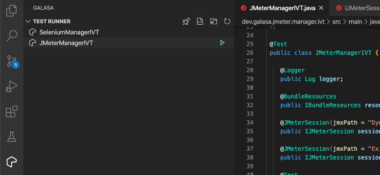
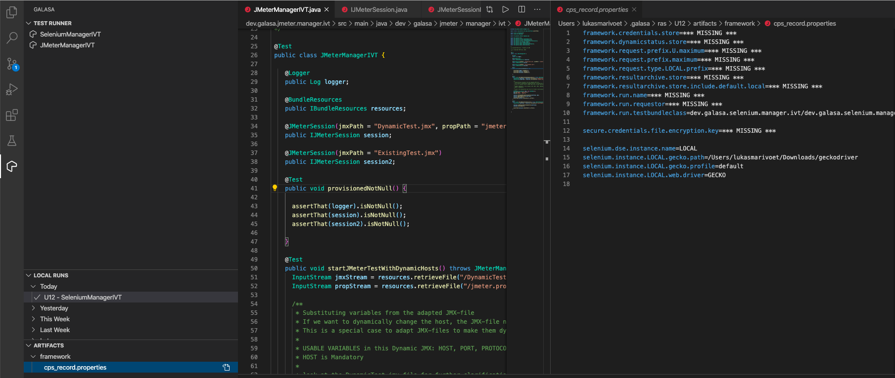

# Galasa for Visual Studio Code

_This extension is directly linked to the [Java Extension Pack](https://code.visualstudio.com/docs/languages/java) to be able to compile your Java-workspace and to build Galasa-tests using Maven for Java. This is installed simultaneously with the Galasa extension._

## Prerequisites

-   [Java JDK 8](https://www.oracle.com/java/technologies/javase-jdk8-downloads.html) is mandatory, any later versions will **not** work
-   [Maven](https://maven.apache.org/download.cgi) needs to be installed, any version compatible with JDK 8

## What is Galasa?

[Galasa](https://galasa.dev/) is an open source deep integration test framework for teams looking to give more power to their testers. What makes Galasa a deep integration test framework is its ability to support tests that cross system boundaries and reach into remote layers inaccessible to other testing tools.

Galasa has been architected to ensure that the routine tasks of writing and executing tests are straightforward. The more complex parts of tests (such as provisioning) are abstracted into other components that can be written by experts and easily distributed to the team.

## Overview of the Galasa extension features

### Generating a testing-environment for running Simbank

**Simbank** simulates a mainframe application. It has been created to show off the hybrid and scalable capabilities of the Galasa Framework without having to deal with the complexities of connecting to an actual mainframe. It is a perfect start to learn and/or understand how the framework operates.


Simbank has been built inside the extension to showcase some of Galasa's capabilities and help you start writing your own Galasa tests.

You can connect with the Simbank-environment using a 3270-emulator and are able to interact it by running the provisioned Galasa tests.

##### This functionality is visible on the TEST RUNNER tab

_All Galasa-related files can be found in the .galasa folder under your user's root._

1. Click the _rocket-icon_ to launch an instance of Simbank running locally on your machine using the Java 8 JDK.

2. Initialise your Galasa environment. (Setup Galasa Workspace icon) _This should have been done during the first launch of the Galasa extension, but can become malformed during runtime of the extension._

3. Initialise your workspace with the Simbank manager and the accompanied Galasa tests. (Create Simbank examples icon). You are able to give this package a desired name. _YOUR_PACKAGE_NAME_

4. First, perform a `mvn install` on _YOUR_PACKAGE_NAME_.manager, then `mvn install` on _YOUR_PACKAGE_NAME_.tests.

5. Set up your cps.properties with the correct properties to be able to run one of the provisioned tests. _The cps.properties is used for personalising specific elements for running Galasa Tests._ For running the IVT you will need to set up the following code. These cps.properties allow your tests to be performed on your locally running instance of Simbank that we had previously activated.


    ```cps.properties
    zos.dse.tag.SIMBANK.imageid=SIMBANK
    zos.dse.tag.SIMBANK.clusterid=SIMBANK

    simbank.dse.instance.name=SIMBANK
    simbank.instance.SIMBANK.zos.image=SIMBANK

    zos.image.SIMBANK.ipv4.hostname=127.0.0.1
    zos.image.SIMBANK.telnet.port=2023
    zos.image.SIMBANK.webnet.port=2080
    zos.image.SIMBANK.telnet.tls=false
    zos.image.SIMBANK.credentials=SIMBANK

    zosmf.server.SIMBANK.images=SIMBANK
    zosmf.server.SIMBANK.hostname=127.0.0.1
    zosmf.server.SIMBANK.port=2040
    zosmf.server.SIMBANK.https=false
    ```

    *You can also reach the Simbank instance using your 3270-emulator of choice.*


    Credentials must be coupled with these tests through the use of the `credentials.properties` file also in `.galasa`

    ```credentials.properties
    secure.credentials.SIMBANK.username=IBMUSER
    secure.credentials.SIMBANK.password=SYS1
    ```

6. Refresh the test runner tab and you should be able to see the provisioned Simbank Galasa Tests.
   Run these Simbank tests by pressing the run-icon next to any test and look at the process in the popped-up terminal.

### Launching a Galasa Test locally.

You can launch a local Galasa test by pressing the Run-icon next to each of your available tests in your currently active environment



### The status overview of your past tests

This tab allows you to view your past tests with their appropriate statusses.

Here you are able to _right-click_ on each test to retrieve the runlog, artifacts and/or delete an entry.
If you open the artifacts, the artifacts tab will be populated with all the artifacts associated with the test that you have _right-clicked_.


These local artifacts are also available through your own file system. They are stored under your user-root in the `.galasa`-folder.

You are able to then click the icon next to the desired artifact to open a file in a `vscode`-window.



## License

[EPL 2.0](LICENSE)
