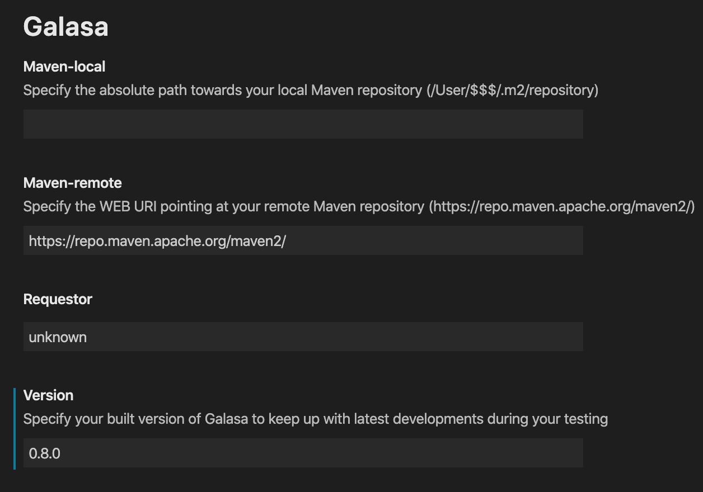
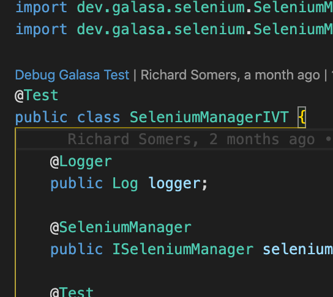
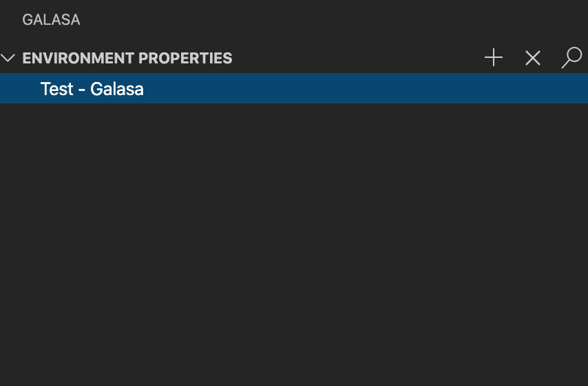
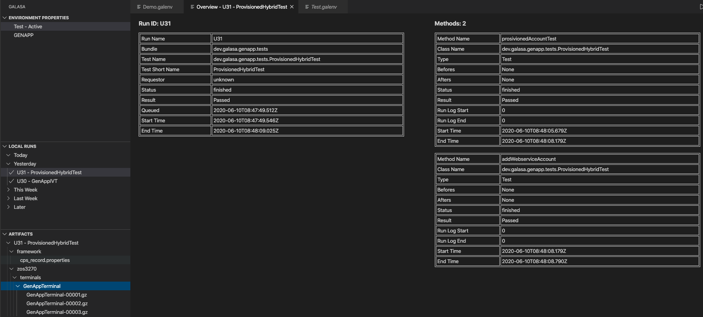
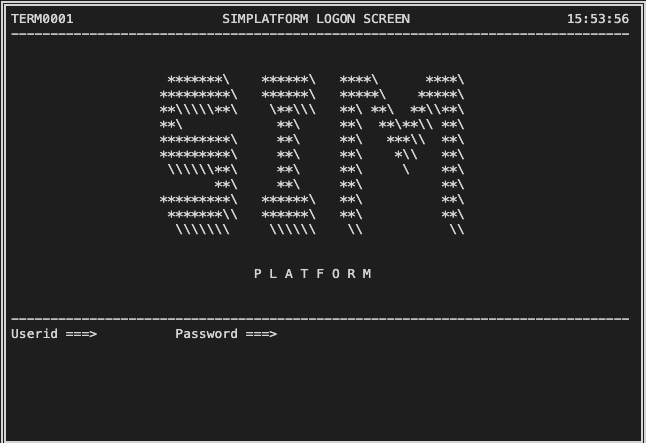

# Galasa for Visual Studio Code

_This extension is directly linked to the [Java Extension Pack](https://code.visualstudio.com/docs/languages/java) to be able to compile your Java-workspace and to build Galasa-tests using Maven for Java. This is installed simultaneously with the Galasa extension._

## Prerequisites

-   [Java JDK 8](https://www.oracle.com/java/technologies/javase-jdk8-downloads.html) is mandatory, any later versions will **not** work
-   [Maven](https://maven.apache.org/download.cgi) needs to be installed, any version compatible with JDK 8

## What is Galasa?

[Galasa](https://galasa.dev/) is an open source deep integration test framework for teams looking to give more power to their testers. What makes Galasa a deep integration test framework is its ability to support tests that cross system boundaries and reach into remote layers inaccessible to other testing tools.

Galasa has been architected to ensure that the routine tasks of writing and executing tests are straightforward. The more complex parts of tests (such as provisioning) are abstracted into other components that can be written by experts and easily distributed to the team.

## Overview of the Galasa extension features

### User configuration



1. Maven-local: If you have a local Maven repository to pull from you can specify this here to take priority over the remote Maven repository
2. Maven-remote: URI for remote Maven Repository
3. Requestor: Defining the name of the Requestor when Requesting a Galasa Run
4. Version: The currently built Galasa version, you would like to use

### Launching a Galasa Test

There are multiple ways to launch a Galasa test in this extension, you are able to use the incode-button or are able to press the button in the upper-right side corner of your screen.

_Running a Galasa test requires you to have built the whole of Galasa for the version that you are currently writing a test for._

Click the `Debug Galasa Test` to start debugging your test. Or you can press the Galasa-icon in the upper-right corner to run the same opened test.



### Setting up custom Environment Properties


Environment properties are there for you to define specific properties that are to be used in `overrides.properties`-file in your `.galasa`-folder. These properties allow you to define specific meta-data for certain tests. You are able to switch between these environments and add properties with their associated values as you wish. If you have utilised an environment of properties fully you are able to even delete this environment.

1. Creating a new environment
2. Adding environment properties to be used for your Galasa-tests
3. Deleting an environment



### Looking at your run-history

You are presented a historic-view of all your Galasa runs. You can interact with them in a couple of ways.

1. Double clicking on a run will give you an overview of the test-structure
2. Showing a list of the generated-artifacts in the artifacts tab. You are then able to open these files and visualise them.
3. Showing a run log
4. Deleting a run log




### Generating a testing-environment for running Simbank

**Simbank** simulates a mainframe application. It has been created to show off the hybrid and scalable capabilities of the Galasa Framework without having to deal with the complexities of connecting to an actual mainframe. It is a perfect start to learn and/or understand how the framework operates.



Simbank has been built inside the extension to showcase some of Galasa's capabilities and help you start writing your own Galasa tests.

You can connect with the Simbank-environment using a 3270-emulator and are able to interact it by running the provisioned Galasa tests.

##### This functionality is visible on the TEST RUNNER tab

_All Galasa-related files can be found in the .galasa folder under your user's root._

1. Click the _rocket-icon_ under local runs to launch an instance of Simbank running locally on your machine using the Java 8 JDK.

2. Initialise your Galasa environment. (Setup Galasa Workspace icon under local runs) _This should have been done during the first launch of the Galasa extension, but can become malformed during runtime of the extension._

3. Initialise your workspace with the Simbank manager and the accompanied Galasa tests. (Create Simbank examples icon). You are able to give this package a desired name. _YOUR_PACKAGE_NAME_

4. First, perform a `mvn install` on _YOUR_PACKAGE_NAME_.manager, then `mvn install` on _YOUR_PACKAGE_NAME_.tests.

5. Set up your cps.properties with the correct properties to be able to run one of the provisioned tests. _The cps.properties is used for personalising specific elements for running Galasa Tests._ For running the IVT you will need to set up the following code. These cps.properties allow your tests to be performed on your locally running instance of Simbank that we had previously activated.


    ```cps.properties
    zos.dse.tag.SIMBANK.imageid=SIMBANK
    zos.dse.tag.SIMBANK.clusterid=SIMBANK

    simbank.dse.instance.name=SIMBANK
    simbank.instance.SIMBANK.zos.image=SIMBANK

    zos.image.SIMBANK.ipv4.hostname=127.0.0.1
    zos.image.SIMBANK.telnet.port=2023
    zos.image.SIMBANK.webnet.port=2080
    zos.image.SIMBANK.telnet.tls=false
    zos.image.SIMBANK.credentials=SIMBANK

    zosmf.server.SIMBANK.images=SIMBANK
    zosmf.server.SIMBANK.hostname=127.0.0.1
    zosmf.server.SIMBANK.port=2040
    zosmf.server.SIMBANK.https=false
    ```

    *You can also reach the Simbank instance using your 3270-emulator of choice.*


    Credentials must be coupled with these tests through the use of the `credentials.properties` file also in `.galasa`

    ```credentials.properties
    secure.credentials.SIMBANK.username=IBMUSER
    secure.credentials.SIMBANK.password=SYS1
    ```

6. Refresh the test runner tab and you should be able to see the provisioned Simbank Galasa Tests.
   Run these Simbank tests by pressing the run-icon next to any test and look at the process in the popped-up terminal.


## License

[EPL 2.0](LICENSE)
